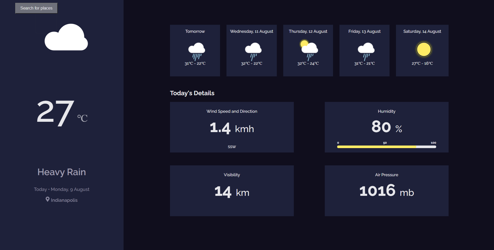

# Weather App

A weather application which you can check daily info about weather. This application uses https://www.metaweather.com/api/ as data source.

Not every city is supported by the API. You can check available cities from [here.](https://www.metaweather.com/map/)

# Desktop

[](https://omercalik-weatherapp.netlify.app/)

## Project setup
```
npm install
```

### Compiles and hot-reloads for development
```
npm run serve
```

### Compiles and minifies for production
```
npm run build
```

### Customize configuration
See [Configuration Reference](https://cli.vuejs.org/config/).
